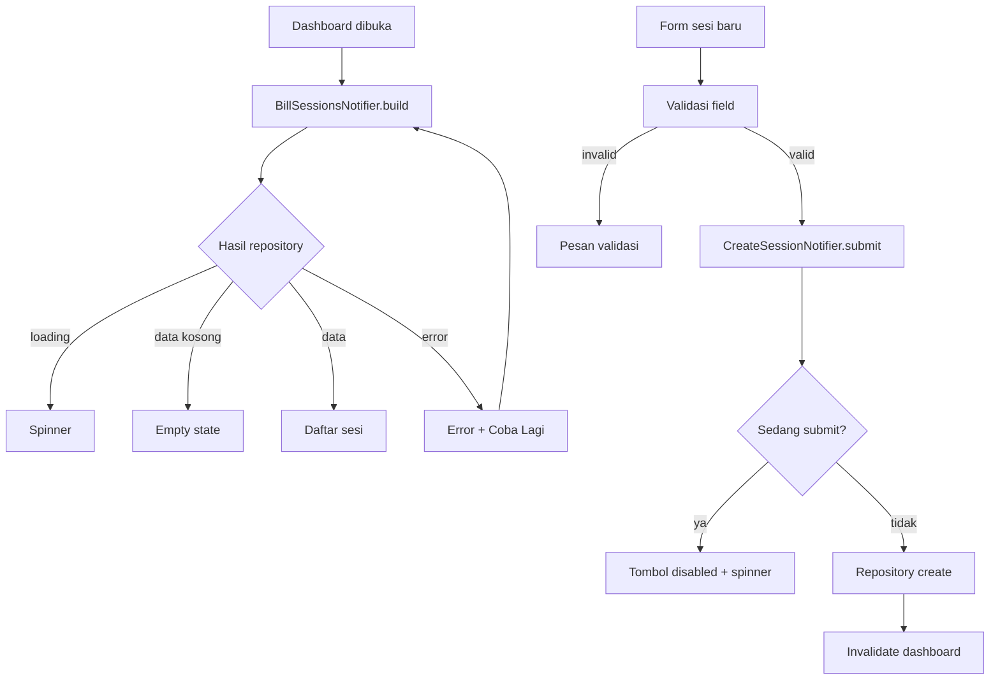

# Panduan Reviewer State Management

## Peta Kode

| Layer | Lokasi | Tanggung jawab |
|---|---|---|
| Screen | `apps/mobile/lib/screens/` | Merender state dan menerima input pengguna |
| Widget | `apps/mobile/lib/widgets/` | Komponen UI reusable; slice ini memakai widget Material langsung |
| Model | `apps/mobile/lib/models/` | Model immutable `BillSession` |
| Repository | `apps/mobile/lib/repositories/` | Kontrak akses data dan implementasi in-memory |
| Validator | `apps/mobile/lib/validators/` | Aturan validasi form |
| State management | `apps/mobile/lib/providers/` | `AsyncNotifier` untuk fetch, retry, submit, dan guard double tap |
| Service | `apps/mobile/lib/services/` | Disiapkan sebagai boundary API pada pengembangan berikutnya |

## Alur Fitur

## Bukti Kondisi

| Kondisi | Widget test | Screenshot/video |
|---|---|---|
| Initial loading | `menampilkan initial loading` | [ISI SENDIRI] Ambil screenshot spinner saat repository ditunda |
| Data berhasil dimuat | `menampilkan data berhasil dimuat` | [ISI SENDIRI] Ambil screenshot kartu sesi |
| Empty state | `menampilkan empty state` | [ISI SENDIRI] Ambil screenshot pesan empty |
| Error + retry | `menampilkan error dan retry berhasil` | [ISI SENDIRI] Ambil screenshot error sebelum retry |
| Validasi input | `menampilkan validasi input form` | [ISI SENDIRI] Ambil screenshot dua pesan validasi |
| Loading submit | `menampilkan loading submit dan mencegah double tap` | [ISI SENDIRI] Ambil screenshot tombol disabled |

## Prompt AI yang Dipakai

1. Aturan proyek: baca `Architecture.md`, gunakan Bahasa Indonesia, Riverpod, pemisahan screen/repository/validator/provider, dan jangan menambahkan komentar yang tidak perlu.
2. Analisis tanpa mengubah kode: petakan kondisi UI dan titik state management yang dibutuhkan.
3. Fondasi repository: buat struktur `apps/mobile`, model immutable, repository interface, dan konfigurasi Riverpod.
4. Fitur dashboard: implementasikan `AsyncNotifier` untuk loading, data, empty, error, dan retry.
5. Fitur form: implementasikan validasi input, submit async, loading, serta pencegahan double tap pada UI dan notifier.
6. Widget test: tulis test untuk enam kondisi utama dengan fake repository yang deterministik.
7. Review AI: cari race condition, state loading yang hilang, retry yang tidak memanggil ulang repository, dan test yang tidak membuktikan perilaku.
8. Dokumentasi: isi peta kode, alur, bukti test, dan catatan pemeriksaan manual.

## Titik yang Saya Periksa dan Perbaiki

- Memperbaiki indentasi `dev_dependencies` pada `pubspec.yaml` agar manifest YAML valid.
- Memastikan `CreateSessionNotifier.submit` mengembalikan lebih awal saat `state.isLoading`, sehingga pemanggilan kedua tidak membuat sesi kedua.
- Memastikan tombol form ikut disabled saat notifier loading, sehingga UI dan guard notifier konsisten.
- Memastikan retry mengubah state ke `AsyncLoading` sebelum menjalankan fetch ulang.
- Memastikan error submit tetap berada pada state notifier dan ditampilkan sebagai pesan Bahasa Indonesia.
- Memastikan test retry mengubah fake repository dari gagal menjadi berhasil, sehingga test memeriksa fetch ulang nyata.
- Menandai screenshot sebagai `[ISI SENDIRI]` karena tidak ada Flutter SDK atau emulator pada environment ini.

## Catatan Batasan

Repository saat ini in-memory sebagai fondasi yang dapat diganti implementasi REST tanpa mengubah screen atau notifier. Flutter/Dart belum tersedia pada environment saat pengerjaan, sehingga `flutter test` belum dapat dijalankan dan screenshot belum dapat diambil.
